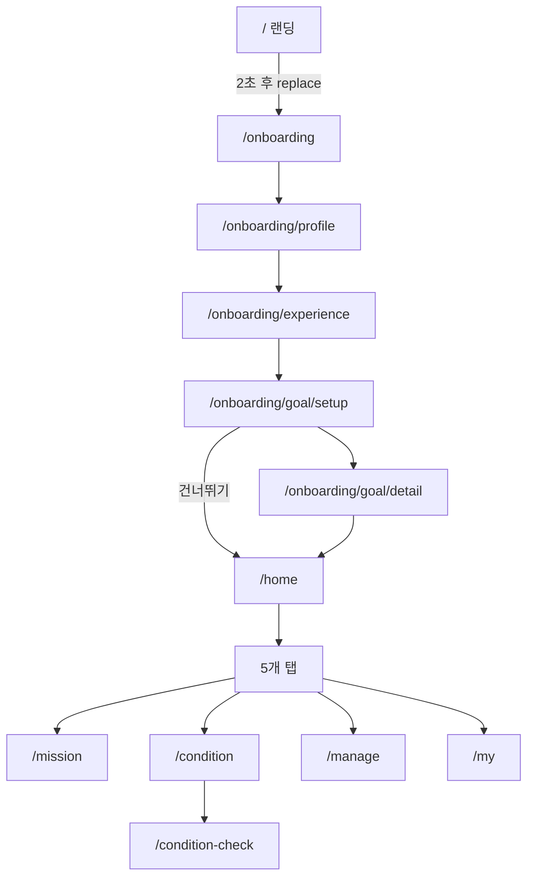
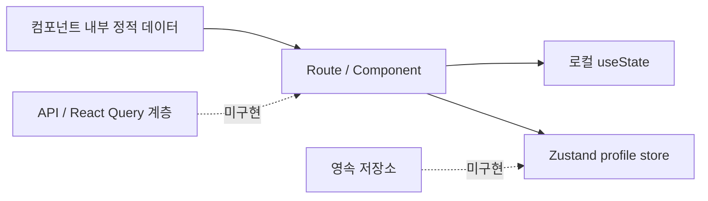

# Runcovery 프론트엔드 프로젝트 분석

> 분석 기준: `dev` 브랜치, 커밋 `8d44395`, 2026-08-16  
> 범위: 애플리케이션 소스, 설정, 의존성, 라우팅, 상태 및 데이터 흐름, 빌드 구성

## 1. 한눈에 보기

Runcovery는 러닝 전후의 컨디션을 확인하고, 러닝 목표와 회복 가이드를 제공하는 Expo 기반 크로스 플랫폼 앱이다. 현재 저장소는 제품의 주요 화면과 사용자 여정을 검증하는 **프론트엔드 UI 프로토타입** 단계에 가깝다.

- Android, iOS, Web을 하나의 React Native 코드베이스로 지원한다.
- Expo Router의 파일 기반 라우팅을 사용한다.
- 온보딩, 목표 설정, 5개 탭, 컨디션 체크, 사후 관리 리포트 화면이 구현돼 있다.
- 프로필 입력값만 Zustand 전역 상태로 유지한다.
- 러닝 기록, 미션, 분석 결과, 웰니스 처방은 현재 정적 데이터다.
- 서버 API, 인증, 영속 저장소, React Query Provider, 폼 검증, 테스트는 아직 없다.
- TypeScript `strict` 모드 검사는 통과한다.
- Expo 공식 진단은 21개 중 20개 항목을 통과했으며, 8개 Expo 패키지의 패치 버전 정렬이 필요하다.

## 2. 제품 기능 범위

| 영역 | 현재 구현 | 데이터 상태 |
| --- | --- | --- |
| 시작 화면 | 네이티브 스플래시 종료 후 2초간 브랜드 랜딩 노출 | 타이머 기반 |
| 온보딩 | 프로필 입력, 러닝 경험 선택 | 프로필만 메모리 저장 |
| 목표 설정 | 추천/직접 설정 분기, 장면 추천, 목표 조정, 요약 | 화면 로컬 상태 및 정적 값 |
| 홈 | 컨디션 개요, 관리 팁, 주변 관리 센터 | 정적 값 |
| 미션 | 주간 및 일일 목표 카드 | 정적 값 |
| 컨디션 | 몸 상태·수면·통증 부위 체크 | 화면 로컬 상태 |
| 사후 관리 | 러닝 만족도·체력·땀·통증 체크, 강도 분석, 웰니스 리포트 | 화면 로컬 상태 및 정적 값 |
| 마이페이지 | 프로필, 주간 미션, 관리 현황, 월간 점수 차트 | 정적 값 |

통증 부위 선택은 앞/뒤 인체 SVG의 세부 Path를 직접 누르는 방식으로 구현되어 있다. 선택값은 `front-head`, `back-left-calf` 같은 타입 안전한 문자열 ID로 관리한다.

## 3. 기술 스택

### 핵심 런타임

| 기술 | 버전 | 역할 | 실제 사용 여부 |
| --- | --- | --- | --- |
| Expo | `~57.0.11` | 앱 런타임과 개발 도구 | 사용 |
| React | `19.2.3` | 선언형 UI | 사용 |
| React Native | `0.86.2` | 네이티브 UI | 사용 |
| React Native Web | `~0.21.0` | 웹 렌더링 | 사용 |
| TypeScript | `~6.0.3` | 정적 타입 검사 | 사용, `strict: true` |

Expo SDK 57 공식 호환표의 React Native 0.86, React 19.2.3, React Native Web 0.21 조합과 일치한다.

### 내비게이션과 플랫폼

| 기술 | 역할 | 비고 |
| --- | --- | --- |
| Expo Router | 파일 기반 Stack/Tab 라우팅 | typed routes 활성화 |
| React Native Screens | 네이티브 화면 스택 기반 | Router의 하위 의존성 |
| Safe Area Context | 노치·시스템 영역 대응 | 공통 레이아웃에서 사용 |
| Expo Linking | 딥링크 기반 | 설치됨, 직접 호출은 없음 |
| Expo Web Browser | 외부 링크를 인앱 브라우저로 표시 | 템플릿 컴포넌트에서 사용 |

### UI와 스타일

| 기술 | 역할 | 비고 |
| --- | --- | --- |
| NativeWind 5 preview | React Native의 `className` 스타일링 | `5.0.0-preview.4`이므로 업그레이드 시 주의 |
| Tailwind CSS 4 | 디자인 토큰 및 유틸리티 생성 | `global.css`의 `@theme` 사용 |
| React Native SVG | 차트, 게이지, 인체 도식 렌더링 | 적극 사용 |
| SVG Transformer | SVG 파일을 React 컴포넌트로 import | 탭 아이콘에 사용 |
| Expo Blur | 공통 배경 블러 | `GradientBackground`에서 사용 |
| Expo Status Bar | 상태 표시줄 제어 | 랜딩 화면에서 사용 |

`expo-image`, `expo-linear-gradient`, `expo-glass-effect`, `@expo/ui`, `expo-device`, `expo-font`, Reanimated, Gesture Handler는 설치되어 있지만 현재 `src`에서 직접 사용되지 않는다.

### 상태, 서버 데이터, 폼

| 기술 | 의도된 역할 | 현재 상태 |
| --- | --- | --- |
| Zustand 5 | 클라이언트 전역 상태 | 프로필 폼에만 사용 |
| TanStack React Query 5 | 서버 상태·캐시 | 설치만 됨, Provider/API 계층 없음 |
| React Hook Form 7 | 폼 상태 관리 | 설치만 됨 |
| Zod 4 + resolvers | 스키마 및 폼 검증 | 설치만 됨 |

## 4. 디렉터리 구조

```text
runcovery-fe/
├─ assets/                    이미지, 캐릭터, 탭 SVG, 앱 아이콘
├─ scripts/                   create-expo-app 초기화 스크립트
├─ src/
│  ├─ app/                    Expo Router 라우트와 화면 조립
│  │  ├─ (tabs)/              홈·미션·컨디션·사후 관리·마이 탭
│  │  └─ onboarding/          온보딩과 목표 설정 라우트
│  ├─ components/
│  │  ├─ body-check/          SVG 인체 도식과 통증 부위 선택
│  │  ├─ home/                홈 카드
│  │  ├─ manage/              사후 관리 단계와 리포트
│  │  ├─ mission/             미션 카드
│  │  ├─ my/                  마이페이지 섹션과 차트
│  │  ├─ onboarding/          온보딩 및 목표 설정 조각
│  │  ├─ shared/              화면 레이아웃과 공통 카드
│  │  └─ ui/                  Button, Input, Label, OptionCard
│  ├─ constants/              테마 상수
│  ├─ hooks/                  테마·색상 모드 훅
│  ├─ stores/                 Zustand 스토어
│  ├─ types/                  공통 도메인 타입과 에셋 선언
│  └─ global.css              Tailwind/NativeWind 디자인 토큰
├─ app.json                   Expo 앱·플러그인·실험 기능 설정
├─ eas.json                   EAS 빌드/배포 프로필
├─ metro.config.js            NativeWind와 SVG 변환 설정
└─ tsconfig.json              strict 타입 검사와 `@/*` 별칭
```

현재 `src/app`에 라우트 파일 14개, `src/components`에 TSX 컴포넌트 51개가 있다.

## 5. 라우팅 구조와 사용자 흐름

`package.json`의 진입점은 `expo-router/entry`이며, 루트 `_layout.tsx`가 전체 Stack과 테마를 구성한다. `(tabs)`는 URL에 포함되지 않는 route group이다.



### 라우트 목록

| URL | 파일 | 역할 |
| --- | --- | --- |
| `/` | `src/app/index.tsx` | 브랜드 랜딩과 온보딩 진입 |
| `/onboarding` | `src/app/onboarding/index.tsx` | 서비스 소개 |
| `/onboarding/profile` | `src/app/onboarding/profile/index.tsx` | 사용자 기본 정보 입력 |
| `/onboarding/experience` | `src/app/onboarding/experience/index.tsx` | 러닝 경험 선택 |
| `/onboarding/goal/setup` | `src/app/onboarding/goal/setup/index.tsx` | 목표 설정 여부 선택 |
| `/onboarding/goal/detail` | `src/app/onboarding/goal/detail/index.tsx` | 목표 설정 내부 스텝 플로우 |
| `/home` | `src/app/(tabs)/home.tsx` | 홈 |
| `/mission` | `src/app/(tabs)/mission.tsx` | 미션 |
| `/condition` | `src/app/(tabs)/condition.tsx` | 컨디션 요약 |
| `/manage` | `src/app/(tabs)/manage.tsx` | 사후 관리 스텝 플로우 |
| `/my` | `src/app/(tabs)/my.tsx` | 마이페이지 |
| `/condition-check` | `src/app/condition-check.tsx` | 상세 컨디션 체크 |

네이티브는 `app-tabs.tsx`에서 5개 하단 탭을 제공한다. 웹은 플랫폼 전용 `app-tabs.web.tsx`가 선택되며 현재 Home 트리거 하나만 제공하므로, 웹과 네이티브의 내비게이션 기능이 동일하지 않다.

## 6. 주요 화면 내부 상태 머신

별도 상태 머신 라이브러리 없이 문자열 union과 `useState`로 단계 전환을 제어한다.

### 목표 상세 설정

```text
Choose
├─ 추천 목표 선택 → Scene → Adjust → Summary → /home
└─ 직접 입력 선택 → Form → Scene → Summary → /home
```

`GoalDetailScreen`이 현재 단계와 선택 ID를 소유하고 하위 컴포넌트에 callback을 전달한다. 입력한 상세 목표와 추천 장면은 화면 전환 후 실제 요약값에 연결되지 않는다.

### 컨디션 체크

```text
body → sleep → pain → loading
```

몸 상태와 수면 선택 카드는 선택 상태를 갖지 않으며, 통증 부위만 배열로 저장된다. 로딩 이후 완료 화면 또는 탭 복귀 로직은 아직 없다.

### 사후 관리

```text
running → energy → sweat → pain → summary → loading
                                            ↓ 1.8초
report ← intensity
```

리포트 생성은 네트워크 요청이 아니라 `setTimeout` Promise로 모사한다. 오류 및 재시도 UI는 준비돼 있지만 현재 Promise는 reject하지 않으므로 오류 경로는 실행되지 않는다. “웰니스 리포트 받기”와 “기록 동기화” 버튼도 같은 다음 단계로 이동한다.

## 7. 상태와 데이터 흐름



### 전역 상태

`useProfileStore`는 `nickname`, `age`, `gender`, `height`, `weight`와 필드 수정·초기화 액션을 제공한다.

- 저장 매체가 없어 앱 프로세스가 종료되면 값이 사라진다.
- 서버 동기화가 없다.
- 숫자 필드도 모두 문자열로 저장한다.
- 입력 검증과 제출 완료 상태가 없다.

### 로컬 상태

- 온보딩의 선택 ID와 목표 설정 단계
- 목표 상세 입력과 사용자 정의 장면
- 컨디션/사후 관리 단계
- 통증 부위 선택 배열
- 사후 관리 로딩 및 오류 표시 상태

### 정적 데이터

미션, 홈 요약, 차트 점수, 러닝 지표, 날씨, 러닝 강도, 처방전, 웰니스 센터는 컴포넌트 내부 상수 또는 기본 prop이다. 백엔드 연동 때는 도메인 타입과 API 응답 타입을 분리하고 화면 내부 상수를 fixture로 이동하는 편이 좋다.

## 8. UI 아키텍처와 디자인 시스템

화면은 대체로 다음 합성 구조를 따른다.

```text
Route screen
└─ GradientScreenLayout
   ├─ GradientBackground (SVG + BlurView)
   └─ SafeAreaView
      └─ ScreenContainer / ScrollView
         ├─ ScreenHeader
         ├─ feature components
         └─ ui components
```

### 강점

- `GradientScreenLayout`, `StepScreenLayout`, `ScreenHeader`로 반복 화면 골격을 재사용한다.
- 색상 팔레트를 `global.css`에 의미 있는 단계로 정의했다.
- SVG 기반 차트와 인체 도식은 해상도 독립적이다.
- 진행률 컴포넌트 일부에는 접근성 role/value가 적용되어 있다.
- `useWindowDimensions`를 이용해 인체 도식과 강도 게이지 크기를 제한한다.
- `.web.tsx` 플랫폼 분기로 웹 전용 탭 구현을 분리했다.

### 현재 한계

- 다수의 크기, 색상, 그림자 값이 각 컴포넌트에 직접 들어가 있다.
- `theme.ts`의 JS 테마와 `global.css`의 CSS 토큰이 병존하지만 서로 완전히 연결되지 않았다.
- `--font-pretendard` 토큰은 있으나 폰트 로딩 코드와 실제 기본 font 적용이 없다.
- `OptionCard`는 `View`라 선택·누름 동작이 없다. 여러 설문 화면이 선택 UI처럼 보이지만 실제 값을 저장하지 않는다.
- 공통 `Button`은 disabled/loading/pressed/focus 상태와 접근성 label을 지원하지 않는다.
- 일부 템플릿 컴포넌트(`ThemedText`, `ThemedView`, 웹 탭)가 제품 디자인 체계와 별도로 남아 있다.

## 9. Expo 및 빌드 구성

### 앱 설정

- 앱 이름/slug: `Runcovery` / `runcovery-fe`
- 화면 방향: portrait
- 딥링크 scheme: `runcovery`
- Android application ID: `com.jjong0923.runcoveryfe`
- 웹 출력: static
- 플러그인: `expo-router`, `expo-splash-screen`
- 실험 기능: typed routes, React Compiler

공식 SDK 57 문서상 typed routes는 Expo Router 링크와 경로의 타입을 생성하고, React Compiler 옵션은 앱 코드를 실험적으로 최적화한다. 현재 `tsconfig.json`에는 `.expo/types`와 `expo-env.d.ts`가 포함돼 있어 typed routes 생성 구조에 맞는다.

스플래시는 `app.json`에서 이미지와 배경을 설정하고, `_layout.tsx`의 전역 범위에서 `preventAutoHideAsync()`를 호출한다. 공식 권장 위치와 일치한다. 다만 실제 hide는 리소스 준비가 아니라 랜딩 화면 mount 직후 호출되며, 이후 2초짜리 별도 랜딩 UI가 표시된다.

### EAS 프로필

| 프로필 | 용도 | 설정 |
| --- | --- | --- |
| development | 개발 클라이언트 | developmentClient, internal 배포 |
| preview | 사내/테스트 배포 | internal 배포 |
| production | 스토어 배포 | build number 자동 증가 |

`appVersionSource: remote`와 production의 `autoIncrement: true` 조합은 EAS 서버가 Android `versionCode`와 iOS `buildNumber`를 관리하는 공식 권장 패턴이다.

### Metro

`metro.config.js`는 Expo 기본 config 위에 두 확장을 결합한다.

1. NativeWind의 Metro wrapper와 `inlineRem: 16`
2. `.svg`를 asset이 아닌 React 컴포넌트로 변환하는 SVG transformer

## 10. 품질과 운영 준비도

### 확인 결과

- `npx tsc --noEmit`: 통과
- `npm ls --depth=0`: 의존성 트리 정상
- `npx expo-doctor`: 21개 중 20개 통과
- 테스트 파일: 없음
- ESLint/Prettier 설정 파일: 없음
- CI 설정: 없음
- API/인증/환경변수 설정: 없음

### Expo 진단 경고

2026-08-16 실행 기준 아래 패키지가 설치된 SDK 57의 최신 권장 패치보다 낮다.

| 패키지 | 현재 | 권장 |
| --- | ---: | ---: |
| `@expo/ui` | 57.0.9 | ~57.0.11 |
| `expo` | 57.0.11 | ~57.0.13 |
| `expo-constants` | 57.0.9 | ~57.0.11 |
| `expo-dev-client` | 57.0.10 | ~57.0.12 |
| `expo-image` | 57.0.2 | ~57.0.3 |
| `expo-linking` | 57.0.5 | ~57.0.6 |
| `expo-router` | 57.0.11 | ~57.0.13 |
| `expo-splash-screen` | 57.0.5 | ~57.0.6 |

업데이트 전에는 `npx expo install --check`, 업데이트 후에는 `npx expo-doctor`와 플랫폼별 실행 검증을 권장한다.

## 11. 주요 리스크와 개선 우선순위

### P0 — 실제 기능 연결 전에 결정할 구조

1. **서버 경계 정의**: `src/api` 또는 기능별 `api/`에 HTTP client, endpoint, query key, DTO를 둔다.
2. **서버 상태 Provider 구성**: 루트 레이아웃에 QueryClientProvider를 추가하고 React Query를 읽기/쓰기의 단일 경로로 사용한다.
3. **폼 모델 통합**: 프로필과 목표 입력을 React Hook Form + Zod로 전환하고 다음 단계 진입 조건을 검증한다.
4. **온보딩 영속성**: SecureStore/AsyncStorage 또는 서버 프로필로 완료 여부와 중간값을 보존한다.
5. **인증과 초기 라우팅**: `/`에서 고정 타이머로 온보딩에 보내는 대신 세션·온보딩 완료 여부로 분기한다.

### P1 — 사용자 흐름 완성

1. `OptionCard`를 선택 가능한 controlled 컴포넌트로 변경한다.
2. 목표 폼 입력값이 추천과 최종 요약에 실제 반영되도록 상태 모델을 만든다.
3. 컨디션 분석 완료 후 결과/탭 복귀 경로를 추가한다.
4. 사후 관리의 “기록 동기화”와 “리포트 생성” 동작을 분리한다.
5. 웹 탭을 네이티브와 같은 5개 항목으로 맞춘다.
6. 처방전 action과 웰니스 센터 카드의 실제 내비게이션을 연결한다.

### P2 — 안정성과 유지보수

1. Expo 패키지 패치 버전을 정렬한다.
2. NativeWind preview 버전을 고정하고 업그레이드 검증 절차를 둔다.
3. ESLint, 포매터, typecheck, 테스트를 CI에서 실행한다.
4. 상태 전환 로직을 reducer 또는 명시적 상태 머신으로 옮겨 불가능한 전이를 막는다.
5. 정적 fixture, 도메인 타입, 표시 컴포넌트를 분리한다.
6. 버튼·선택 카드·입력의 접근성 상태와 오류 문구를 보완한다.
7. 스플래시는 release build에서 반드시 검증한다. Expo Go와 development build는 실제 스플래시 속성을 완전히 재현하지 않는다.

## 12. 권장 목표 아키텍처

규모가 커질 때는 전면 재구성보다 현재 feature 폴더를 점진적으로 확장하는 편이 안전하다.

```text
src/
├─ app/                         라우트 선언과 화면 조립만 담당
├─ features/
│  ├─ auth/
│  ├─ onboarding/
│  ├─ goals/
│  ├─ condition/
│  ├─ running/
│  ├─ recovery/
│  └─ profile/
│     ├─ api/                   endpoint, query, mutation
│     ├─ components/            기능 전용 UI
│     ├─ hooks/                 기능 orchestration
│     ├─ schemas/               Zod 입력/응답 스키마
│     ├─ stores/                필요한 클라이언트 상태만
│     └─ types/                 도메인 타입
├─ shared/
│  ├─ api/                      HTTP client, auth interceptor
│  ├─ components/               공통 UI 및 레이아웃
│  ├─ config/                   환경 설정
│  ├─ lib/                      범용 유틸리티
│  └─ theme/                    토큰과 폰트
└─ test/                        fixture와 테스트 유틸리티
```

권장 책임 분리는 다음과 같다.

- **Expo Router**: URL과 화면 계층
- **React Query**: API 원본 데이터, 캐시, 로딩/오류, mutation
- **Zustand**: 여러 라우트가 공유하지만 서버 원본이 아닌 임시 클라이언트 상태
- **React Hook Form + Zod**: 입력 상태와 검증
- **컴포넌트 local state**: 한 화면에서만 쓰는 펼침, 선택, 애니메이션 상태
- **AsyncStorage/SecureStore**: 서버에 둘 수 없는 최소한의 영속 클라이언트 상태

## 13. 권장 테스트 전략

1. **단위 테스트**: 통증 부위 toggle, 진행률 clamp, 상태 전환 reducer, Zod schema
2. **컴포넌트 테스트**: 입력 오류, 선택 카드, 로딩/오류/재시도, 버튼 disabled 상태
3. **라우팅 통합 테스트**: 온보딩 분기, 목표 설정 분기, 컨디션 완료, 사후 관리 전체 흐름
4. **E2E smoke test**: Android/iOS에서 최초 실행부터 홈 진입, 5개 탭, 딥링크
5. **시각 회귀**: 핵심 화면과 작은 디바이스에서 레이아웃 비교

## 14. 공식 문서 기준

- [Expo SDK 57 문서](https://docs.expo.dev/versions/v57.0.0/)
- [Expo Router SDK 57](https://docs.expo.dev/versions/v57.0.0/sdk/router/)
- [Expo app config SDK 57](https://docs.expo.dev/versions/v57.0.0/config/app/)
- [Expo SplashScreen SDK 57](https://docs.expo.dev/versions/v57.0.0/sdk/splash-screen/)
- [Expo Metro config SDK 57](https://docs.expo.dev/versions/v57.0.0/config/metro/)
- [Expo typed routes](https://docs.expo.dev/router/reference/typed-routes/)
- [EAS app version management](https://docs.expo.dev/build-reference/app-versions/)

---

이 문서는 현재 코드가 실제로 하는 일과 설치만 된 도구를 구분해 작성했다. 구현이 진행되면 특히 데이터 상태, API 경계, 인증/초기 라우팅, 웹 탭 항목을 함께 갱신해야 한다.
